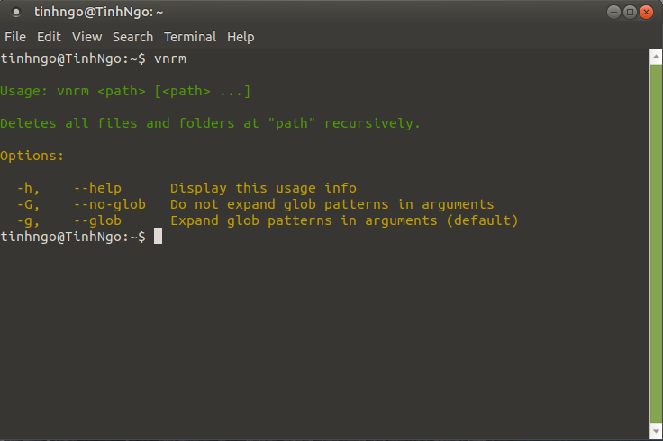

# Super Remove 

Plugin help us remove file and floder in command line


## Supported OperaSystem
* Window
* MacOSX
* Linux

## Install NodeJS
[Install NodeJs click here !](https://nodejs.org/en/)

## Install global

```bash
npm i -g vnrm
```

## Install in project

```bash
npm i vnrm --save-dev
```

## Use

```bash
vnrm <folderName|fileName>
```

## Tutorial 


